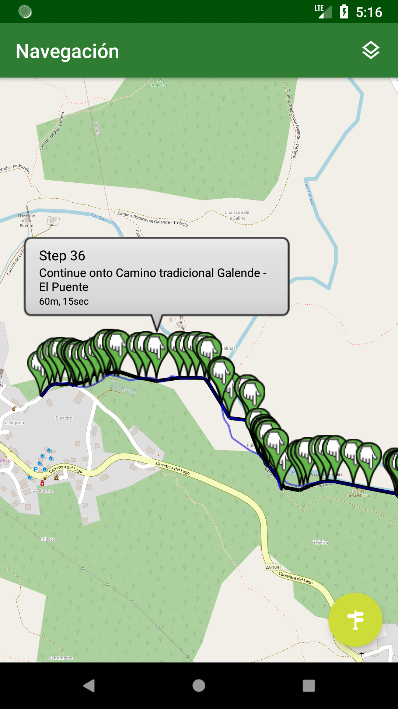

Aplicación Android para consultar la información de los espacios naturales de la comunidad autónoma de Castilla y León así como sus equipamientos. La aplicación utiliza datos extraídos del [portal de Datos Abiertos](https://datosabiertos.jcyl.es) de la [Junta de Castilla y León](http://www.jcyl.es).

Los equipamientos disponibles en la aplicación son los siguientes:

* Aparcamientos
* Zonas recreativas
* Árboles singulares
* Casas del parque
* Refugios
* Zonas de acampada
* Centros de visitantes
* Observatorios
* Miradores
* Quioscos
* Sendas

Además permite el guardado de los equipamientos favoritos y la obtención de los más cercanos dado un radio en metros.

## Descarga

## Capturas de Pantalla
|:-------------------------:|:-------------------------:|:-------------------------:|
|  |    |  |
|  |    |  |

## Licencia
La aplicación se distribuye siguiendo la [General Public License de la GNU, versión 3](https://www.gnu.org/licenses/gpl-3.0-standalone.html) o (a su elección) cualquier versión superior.
